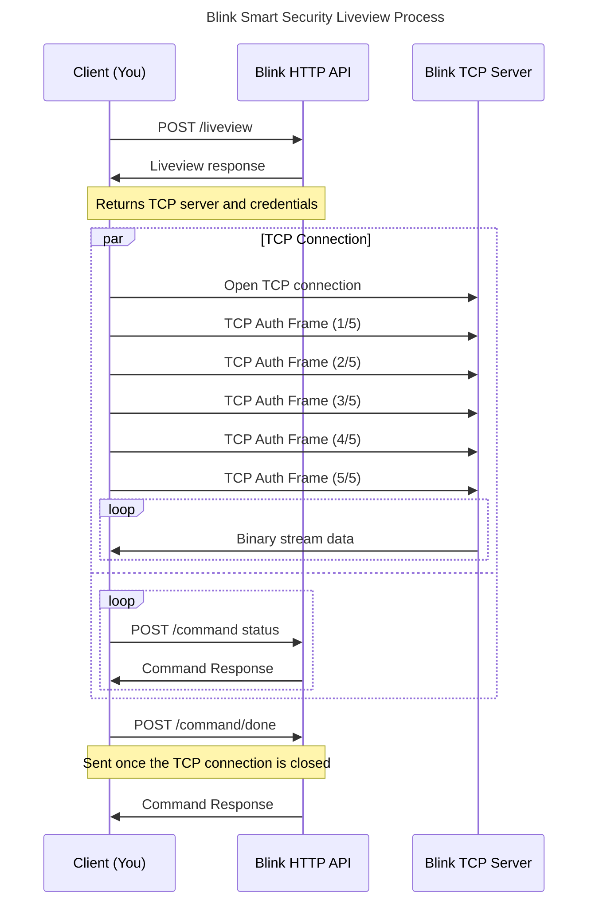

# Introduction

This project offers access into the liveview functionality of the Blink Smart
Security cameras. It has two entrypoints:

- A WebSocket service that can act as middleware between a web application and
the Blink Smart Security Camera
- A CLI command to watch the liveview stream from the command line (ffmpeg)

[](https://goreportcard.com/report/github.com/amattu2/blink-liveview-middleware)
[](https://github.com/amattu2/blink-liveview-middleware/actions/workflows/test.yml)
[](https://github.com/amattu2/blink-liveview-middleware/actions/workflows/codeql.yml)

# Usage

See the following sections for more information on how to use each entry point.
These sections provide instructions on usage without compiling the code yourself.
If you would like to compile the code yourself, see the
Building From Source section below.

## Liveview Command

The liveview script is a simple tool that uses ffmpeg to watch the
liveview stream from a Blink Smart Security Camera. It's primarily used for testing,
but can be used as a standalone tool if desired.

```bash
go run cmd/cli/main.go \
  --region=<region> \
  --token=<api token> \
  --device-type=<lotus|owl|doorbell|etc> \
  --account-id=<account id> \
  --network-id=<network id> \
  --camera-id=<camera id>
```

## Server Usage

The WebSocket server is a middleware service that can be used to proxy
liveview streams from a Blink Smart Security Camera to a web application. It
is designed to be used in conjunction with a web application that can send
commands to the server to start and stop the liveview stream.

It has no built-in authentication or knowledge of the Blink API, so it is up to
your implementing application to provide the necessary information to the server.
Each client that connects to the WebSocket is independent of the others, so
you can have multiple streams running at the same time without overlapping.

Start the server with the following command:

```bash
go run cmd/server/main.go \
  --address=:8080
  --env=<development|production>
```

Then open the sample web application in your browser. Provide the necessary
authentication information on the demo UI and click the "Start Liveview" button:

<http://localhost:8080/index.html>

When deploying the service to production, this page is disabled by default.

## Building From Source

```bash
TODO
```

# Liveview Process

The general process behind obtaining a liveview stream from a Blink camera is
outlined below, ignoring the specifics of the Blink API and any potential error states.



# Dependencies

- Go 1.23+
- ffmpeg / ffplay
